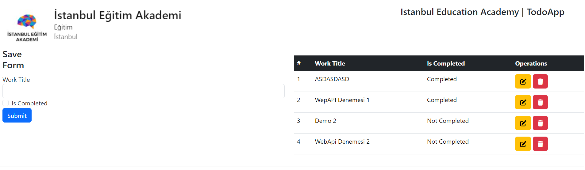
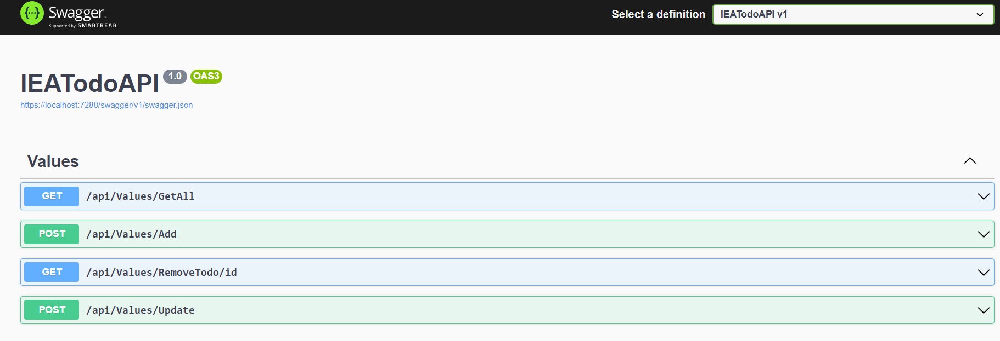

# TodoWebApi-Frontendt-Javascript



English :
# TodoWebApi Frontend

This project contains the frontend part of a ToDo application developed by [nLabsGlobalTechnologgies](https://github.com/nLabsGlobalTechnologgies).

## Project Structure

- **Backend:** The backend of this application is written using ASP.NET 7 Web API. Entity Framework Core 7 is utilized for database operations.

- **Frontend:** The frontend is built using HTML, CSS, and JavaScript. JavaScript is used to connect to the backend API through the Fetch API, enabling functionalities such as listing, adding, updating, and deleting tasks.

## Installation

1. Run the backend: [TodoWebApi Backend](https://github.com/nLabsGlobalTechnologgies/TodoWebApi-Backend)

2. To start the frontend:

    ```bash
    git clone https://github.com/nLabsGlobalTechnologgies/TodoWebApi-Frontendt-Javascript.git
    cd TodoWebApi-Frontendt-Javascript
    ```

    Then open the `index.html` file in your browser to use the application.

## Usage

The application is a simple ToDo app. You can perform the following basic operations:

- **Listing:** View all tasks.
- **Adding:** Add a new task.
- **Updating:** Modify an existing task.
- **Deleting:** Remove a task from the list.

## Contributing

If you want to contribute to the project, please check [CONTRIBUTING.md](CONTRIBUTING.md) for guidelines.

## License

This project is licensed under the [MIT License](LICENSE).


Turkish : 
# TodoWebApi Frontend

Bu proje, [nLabsGlobalTechnologgies](https://github.com/nLabsGlobalTechnologgies) tarafından geliştirilen bir ToDo uygulamasının frontend kısmını içerir.

## Proje Yapısı

- **Backend:** Bu uygulamanın backend kısmı, ASP.NET 7 Web API kullanılarak yazılmıştır. Entity Framework Core 7, veritabanı işlemleri için kullanılmıştır.

- **Frontend:** Frontend kısmında ise HTML, CSS ve JavaScript kullanılmıştır. JavaScript kullanılarak, Fetch API aracılığıyla backend API'ye bağlanılarak, listeleme, ekleme, güncelleme ve silme işlemleri gerçekleştirilmektedir.

## Kurulum

1. Backend kısmını çalıştırın: [TodoWebApi Backend](https://github.com/nLabsGlobalTechnologgies/TodoWebApi-Backend)

2. Frontend kısmını başlatmak için:

    ```bash
    git clone https://github.com/nLabsGlobalTechnologgies/TodoWebApi-Frontendt-Javascript.git
    cd TodoWebApi-Frontendt-Javascript
    ```

    Daha sonra tarayıcınızda `index.html` dosyasını açarak uygulamayı kullanabilirsiniz.

## Kullanım

Uygulama, basit bir ToDo uygulamasıdır. Aşağıdaki temel işlemleri gerçekleştirebilirsiniz:

- **Listeleme:** Tüm görevleri görüntüleme.
- **Ekleme:** Yeni bir görev ekleyebilme.
- **Güncelleme:** Var olan bir görevi güncelleme.
- **Silme:** Bir görevi listeden silme.

## Katkıda Bulunma

Eğer projeye katkıda bulunmak istiyorsanız, lütfen [CONTRIBUTING.md](CONTRIBUTING.md) dosyasını inceleyin.

## Lisans

Bu proje [MIT lisansı](LICENSE) altında lisanslanmıştır.
